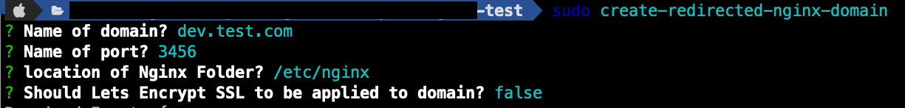
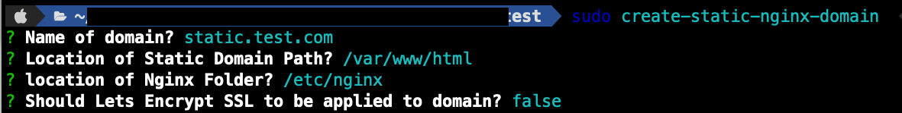

  

# Nginx Domain Assist: Streamlined Domain Management for Nginx Servers

## Introduction
Nginx Domain Assist is a  Node.js console application tailored  to efficiently manage their nginx web server domains. 

With Nginx Domain Assist, the complexities of server block configurations are abstracted into simple command-line operations. Whether you're deploying a new static website, setting up a domain redirection, or securing your domain with SSL certificates through Let's Encrypt, this tool automates the necessary steps with precision and ease.

Key Features of Nginx Domain Assist:
- **Automated Domain Creation**: Quickly configure static or redirected domains on your Nginx server with minimal input, allowing you to focus on content rather than configuration.
- **Seamless Domain Deletion**: Safely remove domains from your server without the risk of leaving residual configuration files that could cause conflicts or security issues.
- **Effortless Domain Enumeration**: Instantly retrieve a list of all domains managed by your Nginx server, helping you keep track of your digital estate with clarity.
- **Instant Domain Status Checks**: Verify the operational status of your domains in real-time, ensuring that your websites are accessible and running as expected.
- **Integrated SSL Support**: Opt for automatic SSL configuration with Let's Encrypt integration, providing robust security for your domains with just a few keystrokes.

By automating routine tasks and offering a user-friendly interface, Nginx Domain Assist empowers users to manage their web presence with confidence and efficiency. Whether you're a seasoned sysadmin or a web developer looking to streamline your workflow, Nginx Domain Assist is your command-line companion for Nginx domain management.


## Prerequisites

Before using Nginx Domain Assist, ensure the following prerequisites are met:

1. **Nginx Installed:** Nginx must be installed on your system. You can download and install Nginx from [Nginx's official website](http://nginx.org/) or through your operating system's package manager (like `apt` for Ubuntu, `yum` for CentOS).

2. **Certbot for Let's Encrypt:** If you intend to use SSL functionalities (Let's Encrypt), Certbot should be installed. Certbot is an easy-to-use automatic client that fetches and deploys SSL/TLS certificates for your web server. Visit [Certbot's official website](https://certbot.eff.org/) for installation instructions specific to your operating system and web server.


Ensure that these prerequisites are properly set up and configured before using Nginx Domain Assist to manage your Nginx domains.

## Installation
To install Nginx Domain Assist globally, run:
```
npm install -g nginx-domain-assist
```


## Usage
After installation, the following commands are available globally. The Commands can be run directly in the terminal. If required options are not passed as arguments, the application will prompt you for them interactively. Also please note all the command requires sudo access to run.

### Create Redirected Nginx Domain
```
create-redirected-nginx-domain --domain [domain] --port [port] --nginxFolder [path] --useSSL [boolean]
```
- `--domain`: Name of the domain (default: example.com).
- `--port`: Port number for the domain.
- `--nginxFolder`: Location of the Nginx folder (default: /etc/nginx).
- `--useSSL`: Boolean to decide if Let's Encrypt SSL should be applied (default: false).

if no options are passed, the application will prompt you for the required options


### Create Static Nginx Domain
```
create-static-nginx-domain --domain [domain] --path [path] --nginxFolder [path] --useSSL [boolean]
```
- `--domain`: Name of the domain (default: example.com).
- `--path`: Location of the static domain path (default: /var/www/example.com).
- `--nginxFolder`: Location of the Nginx folder (default: /etc/nginx).
- `--useSSL`: Boolean to decide if Let's Encrypt SSL should be applied (default: false).

if no options are passed, the application will prompt you for the required options


### Delete Nginx Domain
```
delete-nginx-domain --domain [domain] --nginxFolder [path]
```
- `--domain`: Name of the domain to be deleted (default: example.com).
- `--nginxFolder`: Location of the Nginx folder (default: /etc/nginx).

### List All Nginx Domains
```
list-all-nginx-domains --nginxFolder [path]
```
- `--nginxFolder`: Location of the Nginx folder (default: /etc/nginx).

### Domain Status By Name
```
domain-status-by-name --domain [domain] --nginxFolder [path]
```
- `--domain`: Name of the domain (default: example.com).
- `--nginxFolder`: Location of the Nginx folder (default: /etc/nginx).


Alternatively You can also use npx to run the commands
```
npx -p nginx-domain-assist list-all-nginx-domains
```


#### License
MIT


